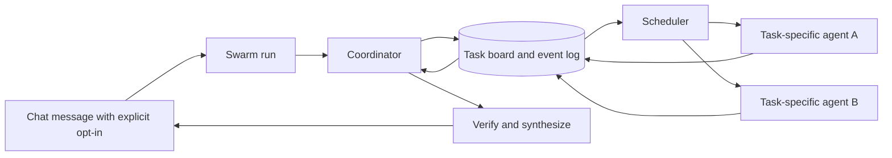

# Opt-in agent swarm for Tomo

Status: core implementation complete, 2026-09-30. Per-turn opt-in, internal skill proposals, session-local agents, a durable task board, bounded dependency scheduling, and chat progress are implemented. Live-model quality and production-scale evaluation remain follow-up work.

## Product contract

1. Ordinary chat runs one agent. Complexity, the presence of multiple installed agents, and an old multi-agent session never silently enable swarm.
2. A user can opt into swarm on **any message in any existing chat**, by selecting a composer action or sending `/swarm <task>`. A plainly worded request such as “pakai swarm untuk …” is also accepted when its intent is unambiguous. The selected mode belongs to the **turn**, not the conversation. `@agent` continues to mean direct conversation handoff, not swarm.
3. The chat list and header show the conversation title and active agent. Remove the generic “swarm” badge, “New swarm chat” title, and “Message the swarm” default copy. During an opted-in run, a work panel shows the actual agents, tasks, dependencies, results, and failures. This is progress information, not a label on the chat.
4. A swarm run must comprise more than several `delegate` calls. The coordinator can **use a configured agent directly or create a task-specific agent dynamically**, revise assignments as work arrives, route findings between agents, and synthesize a verified result. Both kinds may work in the same run. It may decide that one agent is sufficient for a simple request, even after opt-in.
5. Dynamically created agents belong to the current **chat session**. They may retain their task context and be reused by a later explicitly requested swarm turn in that chat. They never appear in the global Agent Studio roster, never join other chats, and are removed with the session. Their existence does not turn later messages into swarm runs.

## Research and implications

- [Kimi's Agent Swarm description](https://www.kimi.com/en/help/agent/agent-swarm) explicitly says the system creates subagent instances for tasks without predefined roles, with a commander choosing the organization. Its scale and PARL training are model capabilities; Tomo can implement an orchestration runtime, but should not claim equivalent training or throughput. Kimi's public description does not specify the exact lifetime of each instance, so session scope here is a Tomo product requirement.
- [Kimi K2.5 technical report](https://arxiv.org/abs/2602.02276) describes self-directed decomposition into heterogeneous subproblems with concurrent execution. This supports task-specific workers and a coordinator that can change its plan.
- [Anthropic's multi-agent engineering report](https://www.anthropic.com/engineering/multi-agent-research-system) reports that vague briefs cause duplicated work, parallelism is useful mainly where tasks are independent, and synchronous batch barriers block steering. It calls for checkpoints, tracing, and outcome evaluations.
- [OpenAI's orchestration guide](https://openai.github.io/openai-agents-python/multi_agent/) separates manager-owned specialist calls from a full conversational handoff and recommends choosing model-controlled versus code-controlled orchestration deliberately. Tomo needs both: a model proposes work, while code enforces access, limits, state, and completion.
- [LangGraph Swarm's state guide](https://langchain-ai.github.io/langgraphjs/reference/modules/langgraph-swarm.html) makes short-term memory and explicit state transfer central to multi-turn collaboration. Tomo needs a run-specific shared board, separate from conversation history and long-term memory.
- [xAI's Grok 4.20 model card](https://data.x.ai/2026-04-07-grok-4-20-model-card.pdf) publicly confirms separate single-agent and multi-agent modes. It does not disclose enough implementation detail to copy Grok's scheduler; Tomo should avoid claiming that its internals match Grok.

## Audit of current Tomo

| Current path | What it does | Gap |
| --- | --- | --- |
| `app/static/js/dashboard.js`, `app/static/js/sessions.js` | Dashboard and new chat default to all enabled agents; UI labels a multi-member session “swarm.” | Opt-in and truthful labeling. |
| `app/models/mixins/sessions.py`, `app/channels/web.py` | Two stored members imply swarm; live enabled agents are added automatically. | Membership is confused with execution mode; existing chats cannot opt in for one turn or create session-local agents. |
| `app/runtime/agent/loop.py` | Multiple `delegate` tool calls from one LLM response run concurrently, then the parent waits for all results. | No persistent task graph, dynamic allocation, interim steering, or bounded fanout. |
| `app/runtime/agent/subagent.py` | Nested agent gets a brief and its own model/tools; depth is capped. | Context is a one-time prompt; no mailbox, incremental shared findings, or durable worker resume. |
| `app/models/mixins/swarm_notes.py` | Saves a note when a delegate completes. | Notes are retrospective memory, not an operational task board. |
| `app/services/chat.py`, `app/channels/sse_map.py` | Background turn and SSE replay survive browser disconnect. | In-flight worker/task state is not durable across server restart. |
| `app/runtime/agent/loop.py:_authorize_tool` | Nested delegates skip HITL in some cases. | Permission behavior must be audited and made explicit before swarm can run mutating tools. |

## Runtime design

### Turn entry and plan

- Parse an explicit `/swarm` command at the API boundary. Pass the mode as structured turn data, not hidden text appended to the user prompt. Add a composer action that sends the same flag. Recognize natural-language opt-in only for high-confidence explicit requests; false positives are worse than misses. Store the chosen mode with the user message so refresh and replay agree.
- The coordinator receives the task, configured agents, available models/tools/workplaces, budget, and prior conversation. It can choose **solo** or emit typed `use_configured_agent`, `spawn_session_agent`, and `create_task` operations. It defines each new agent's name, purpose, model/profile, tools, and scope from the task. A task records objective, expected output, allowed tools/workplace, dependency IDs, write scope, and success criteria. Model output is validated; invalid tasks are rejected with feedback to the coordinator.
- **Selection rule:** use a configured agent directly when the user names it or when its existing model, tools, memory, or workplace access are materially useful. Preserve its configured instructions and permissions. Spawn a session-local agent when the task needs a new perspective, several copies of a role, or a narrow context that no configured agent provides. A run may combine both. Never fan out merely because agents are installed, and never grant a dynamic agent access it did not inherit explicitly.
- The plan is not a fixed batch. The coordinator may add, cancel, or reassign tasks after seeing results. Enforce a maximum number of active workers and total tasks from settings. Independent ready tasks launch immediately; dependent tasks wait only for their prerequisites.

### Workers and collaboration

- A dynamic worker is a **session-local agent instance** with its own context and model, possibly using an existing agent profile as a template. Its identity, instructions, and compacted task context persist across explicitly requested swarm turns in that chat, but it is never inserted into the global `agents` table. A single session may have several instances of the same role. A configured worker keeps its global agent identity and settings but receives a run-specific task context; it is not copied into the session registry. Work briefs contain a precise boundary and expected result. Task-specific context keeps tokens and unrelated history out of the worker.
- Separate the session-local agent definition from each task execution. A worker can complete one task, receive a new one, or be retired by the coordinator. Session deletion cascades to its agent instances and their private context. Normal solo turns cannot address those instances implicitly; direct `@` routing must remain a separate explicit action.
- Workers publish findings, artifacts, blockers, and completion to an append-only run board. The coordinator and authorized peers can read these while other tasks still run. Add `publish_finding`, `send_to_agent`, `read_board`, `request_followup`, and `finish_task` operations. Each item carries author, task ID, timestamp, and source/artifact references.
- Coordinator messages can steer a live worker, request verification, or change its brief. Workers can request help, but creating more workers remains subject to scheduler budgets and permissions. The board prevents the coordinator from mistaking a worker's tool run for its own.
- For code edits, default to non-overlapping file ownership or isolated worktrees with explicit integration. Do not run independent mutating workers against the same files. For read-only research, parallelism can be broader.

### Scheduler, durability, and safety

- Persist `session_agent_instances`, `swarm_runs`, `swarm_tasks`, and ordered `swarm_events` with stable session/run/agent/task IDs and clear states (`queued`, `running`, `blocked`, `done`, `failed`, `cancelled`). Put session ownership on every row and cascade deletion. Make task state transitions transactional. Checkpoint before and after external tool calls where feasible. Server restart resumes safe tasks or marks ambiguous side effects for inspection; it must not silently repeat a mutating call.
- Scheduler enforces per-run and global concurrency, deadlines, token/cost budgets, task dependencies, and ownership of write scopes. It starts ready tasks independently of unrelated slow workers, handles one worker's failure without discarding other results, and propagates user cancellation to all active workers.
- Keep the existing permission policy at the worker tool boundary. A nested worker must not gain a broader grant merely because the coordinator started it. Explicitly test tool approval, user identity, workplace access, and cancellation.
- Emit structured SSE events (`run`, `task`, `finding`, `worker`, `message`) with sequence IDs and replay from the durable event log. The UI renders the work panel from those events, so reload shows the same state.

### Completion

- The coordinator evaluates task results against the original request and each task's success criteria. It can launch focused follow-ups within budget. Final synthesis distinguishes completed work, evidence, unresolved work, and errors. It must not treat a failed agent or an empty answer as success.
- Record run metrics: active worker overlap, critical path, tokens/cost per worker, duplicate work, retries, failures, and user cancellation. These measure whether swarm helped rather than merely increasing agent count.

## Implementation sequence

1. **Contract and UI:** Add per-turn `execution_mode` to chat API and stored user entry; default `solo`. Add composer opt-in and `/swarm` parser for existing chats. Remove generic swarm labels and auto-multi-agent new-chat behavior. Preserve legacy sessions without silently enabling swarm.
2. **Session-local agent registry and durable board:** Add session agent/run/task/event tables and store methods, with ownership checks, deletion lifecycle, and a migration. Add structured SSE replay from the event log.
3. **Scheduler and worker runtime:** Build typed agent creation and task operations, validators, session-local worker instances, dependency-aware scheduling, concurrency and budget limits, cancellation, and failure states. Reuse tool execution only after reviewing approval semantics and context isolation.
4. **Coordinator loop:** Model-proposed tasks, mid-run board reads, steering, follow-ups, verification, and synthesis. Keep code responsible for invariants; keep the model responsible for strategy.
5. **Work panel and evaluation:** Show actual task progress, not a generic badge. Exercise scripted scenarios and a small real-model evaluation set, compare solo against swarm for quality, latency, cost, and unwanted activation.

## Acceptance cases

- A normal message in a new or old chat starts no worker and shows no swarm label.
- `/swarm investigate X` in an existing solo chat creates a run; the next message is solo unless it opts in again. The composer action behaves the same way.
- The coordinator can spawn two new session-local agents with different instructions even when the global roster contains only Tomo. They can be reused only in that chat and disappear with it; they never show up in Agent Studio or another user's session.
- If the user names a configured agent, the scheduler uses that actual agent and its assigned model/tools/workplace. The same run can also create a dynamic agent for an independent perspective. Neither worker receives broader access through the swarm.
- Two independent workers overlap in time; a dependent worker starts only after its prerequisite publishes a result. The coordinator can react to an early finding while another worker is still running.
- A worker can publish a finding and receive a coordinator message before it finishes. Results and attribution survive browser reload and server restart.
- Overlapping file writes are blocked or isolated. A denied worker tool remains denied. Cancellation stops every worker and leaves a truthful run record.
- A worker failure leaves successful sibling results available, and the final answer names the failure. Budget exhaustion ends cleanly with partial results.
- A simple opted-in question may be handled by one agent; the run trace explains that decision.
