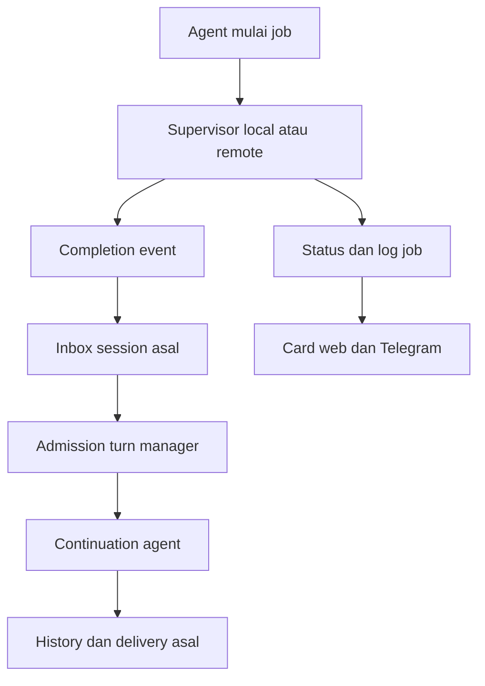
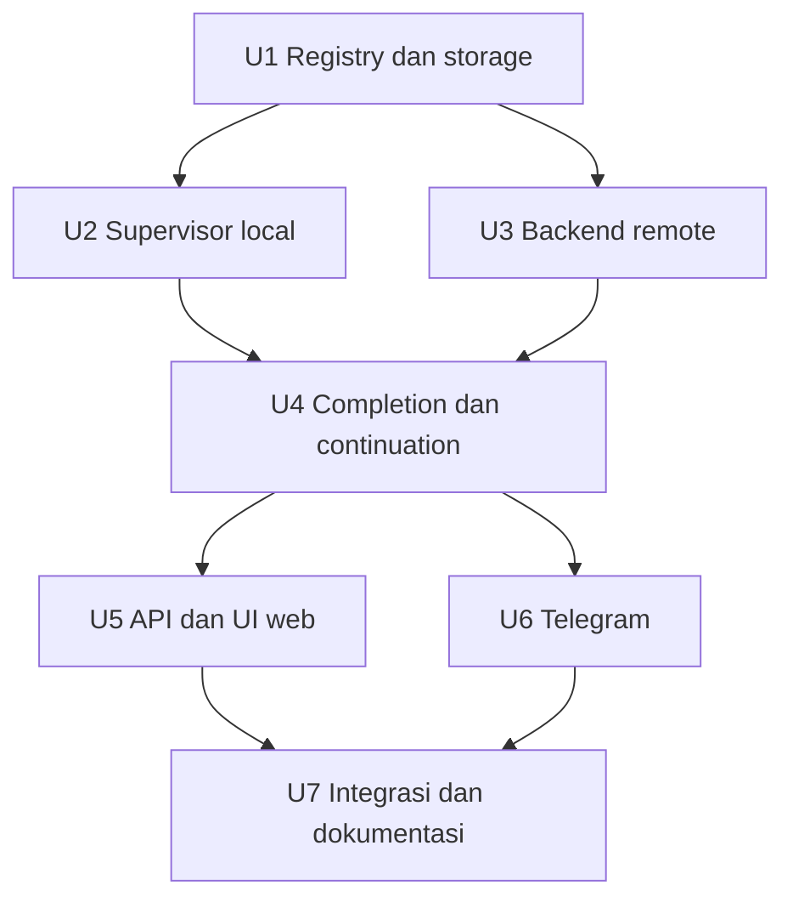

# Spec: Background jobs dengan continuation agent

## Summary

Tomo menjalankan beberapa background job dalam satu percakapan. Runtime mengawasi proses dan log setelah turn agent selesai, lalu mengantrekan continuation di session asal ketika job selesai atau gagal. Web menampilkan job card dan tab Processes; Telegram menyediakan pesan job dengan kontrol status, log, dan stop yang tetap tersedia setelah turn berakhir.

Dokumen ini merupakan spec perilaku sekaligus pembagian implementasi. Sumber kebutuhan adalah percakapan BB `thr_t25gdeme75` dan lanjutannya `thr_wj3d3chqu8`: tanpa polling agent, status saat ditanya, UI web, banyak job per chat, hubungan ke chat asal, dan Telegram.

---

## Problem Frame dan kondisi kode

Saat ini agent mendapat ID dari `bash(background=true)`, tetapi tidak menerima hasil otomatis. Agent perlu meminta status lagi agar tahu proses sudah selesai. Status agent idle dan proses running juga belum memiliki tampilan terpisah.

Temuan yang menentukan implementasi:

- `app/runtime/tools/process_registry.py` memiliki registry global dalam memori dengan `agent_id`, tanpa owner/session/workplace. Output lokal baru diambil setelah proses exit; pipe dapat penuh sebelum exit.
- `app/runtime/tools/bash.py` sudah memiliki pembacaan output untuk foreground. Jalur background belum menggunakan lifecycle dan pembatasan output yang setara.
- `app/runtime/tools/process.py` menyediakan list/status/kill, tetapi listing dan routing belum terikat job di session asal.
- `connector/internal/executor/jobs.go` membaca output selama eksekusi dan menyimpan exit code. Registry tetap dalam memori, batas running 16, hasil selesai memiliki TTL 15 menit.
- `app/workplaces/ssh_exec.py` perlu diperbaiki sebelum parity: identitas/log job harus terpisah, exit code harus berasal dari proses yang benar, dan daftar job tidak boleh berasal dari pemindaian semua proses bash.
- `app/services/chat.py` memiliki `start_session_turn`, lease session, cancellation, dan SSE untuk turn. Background completion harus masuk melalui lease tersebut.
- `app/channels/telegram.py` menyimpan dispatcher/antrean per chat Telegram; forum topics berbagi conversation history. Mengikat job hanya ke session belum cukup untuk menentukan topic dan aktor.
- Activity card `TelegramTurnUI` dibersihkan ketika final terkirim; job card memerlukan lifecycle terpisah.
- Workspace Files/Terminal sedang berubah di working tree. Integrasi Processes mengikuti hasil akhir perubahan tersebut tanpa menggantikan Terminal interaktif.

---

## Requirements

| ID | Perilaku wajib |
| --- | --- |
| R1 | Satu session dapat memiliki banyak job running dengan ID dan lifecycle terpisah. |
| R2 | Job tetap berjalan setelah turn agent selesai, browser ditutup, atau pengguna pindah chat. |
| R3 | Runtime menguras stdout/stderr selama proses berjalan; output dan resource dibatasi. |
| R4 | Selesai/gagal menghasilkan satu completion event; idle memulai continuation, busy mengantrekannya. Agent tidak perlu polling berulang. |
| R5 | Pertanyaan status dapat membaca job yang masih running, elapsed time, exit code bila tersedia, dan log terbaru. |
| R6 | Setiap job memiliki owner, session, turn/pesan asal, workplace/backend, dan tujuan channel yang ditangkap saat start. |
| R7 | Semua akses list/status/log/stop memakai ownership dan tujuan asal; ID saja tidak memberikan akses. |
| R8 | Web menyediakan card per job, Processes per session, log detail, stop job, dan navigasi ke chat/pesan asal. |
| R9 | Telegram menyediakan pesan persisten per job, refresh/status/log/stop, dan continuation ke chat/topic asal. |
| R10 | Stop agent berbeda dari stop job; cancellation, `/new`, penghapusan chat, dan restart memiliki hasil eksplisit. |
| R11 | Status proses, status continuation, dan status delivery dipisah. Gangguan koneksi tidak dilaporkan sebagai sukses. |
| R12 | Nudge memakai history dan permission session asal; background continuation berjalan solo dan tidak otomatis mengaktifkan swarm. |

---

## Scope Boundaries

V1 mencakup local, tunnel connector, dan SSH melalui kontrak job yang sama. Local boleh menjadi tahap pertama implementasi, tetapi remote tidak boleh dinyatakan selesai sebelum exit code, log, routing, dan stop memenuhi kontrak.

Tidak termasuk scheduler/cron baru, laporan agent berkala, trigger pola output, progress persen hasil tebakan, input interaktif ke background job, atau dashboard global lintas chat. Terminal PTY tetap fitur tersendiri.

### Deferred to Follow-Up Work

- Jaminan proses dan continuation aktif bertahan saat crash/restart server atau connector.
- Push completion dari connector; v1 dapat memakai pengamatan RPC di runtime.
- Pengubahan seluruh Telegram forum history menjadi session per topic. V1 mengisolasi operasi job berdasarkan topic/aktor, tetapi tidak mengklaim history forum yang sudah shared menjadi privat.
- Pengiriman log tanpa batas ukuran dan retensi arsip jangka panjang.
- Tombol Telegram “Buka di web” dapat ditambahkan sesudah tersedia konfigurasi URL Tomo publik yang benar; kontrol inti tidak bergantung pada link tersebut.

---

## Keputusan dan model data

| Keputusan | Alasan |
| --- | --- |
| Perluas bash/process dan turn manager yang ada | Menghindari jalur agent dan permission kedua. |
| Simpan metadata, completion event, dan delivery receipt di SQLite | Refresh browser tidak menghilangkan job; hasil dan tujuan dapat direkonsiliasi. Ini bukan jaminan process recovery. |
| Supervisor dimiliki lifecycle aplikasi, bukan task turn/UI | Turn selesai atau subscriber terputus tidak membunuh proses. |
| ID Tomo unik; backend handle disimpan terpisah | PID, ID connector, atau alias tampilan dapat berbenturan lintas workplace. |
| Setiap terminal event memiliki identitas stabil dan claim atomik | Race completion, status refresh, dan drain tidak membuat turn ganda. |
| Satu continuation batch hanya berisi satu session dan satu tujuan channel/topic/aktor | Hasil tidak tercampur atau dikirim berdasarkan chat yang sedang dibuka. |
| Admission continuation mengikuti lease session dan dispatcher Telegram | Session lease saja tidak mencegah benturan activity card dispatcher per chat. |

Record job minimal berisi identitas job; owner saat start; session; originating turn dan pesan/tool call; agent pelaksana; workplace dan jenis backend; opaque backend handle; command dan cwd; waktu mulai/selesai; process status; exit code atau alasan kehilangan observasi; log cursor dan indikator truncation; stop intent; completion event ID; tujuan channel/aktor/topic dan bot identity; job-card message ID; serta status continuation dan delivery.

Owner/session/workplace/channel ditangkap dari context runtime tepercaya. Model hanya memilih command dan workplace yang memang diizinkan. Model tidak boleh memasok penerima Telegram, session owner, token, PID arbitrer, atau binding job.

Metadata dan ringkasan hasil bertahan bersama history session. Log disimpan terpisah di storage session, dengan batas dan cleanup. Usulan default implementasi v1: maksimum 16 job aktif per aplikasi, tetap tunduk pada limit backend; maksimum 1 MiB tail log gabungan per job; log selesai disimpan tujuh hari. Lewat batas admission menghasilkan error busy, bukan antrean start tersembunyi. Truncation/expiry ditampilkan; “log lengkap” berarti seluruh log yang masih tersimpan, bukan jaminan output tanpa batas. Angka ini adalah default teknis yang dapat disesuaikan sebelum implementasi, bukan kebutuhan yang diminta pengguna.

---

## Lifecycle proses dan observasi

| State | Makna |
| --- | --- |
| Starting | Start diterima; handle belum terkonfirmasi. |
| Running | Backend mengonfirmasi proses aktif. |
| Stopping | Stop dikirim; exit belum terkonfirmasi. |
| Succeeded | Proses terkonfirmasi exit 0. |
| Failed | Proses terkonfirmasi exit nonzero atau gagal start. |
| Stopped | Stop pengguna terkonfirmasi menghentikan proses. |
| Unknown | Observasi terputus; proses mungkin masih berjalan. |
| Interrupted | Supervisor lokal hilang/restart dan hasil proses tidak dapat dipastikan. |

Disconnect remote menjadi Unknown dengan timestamp pengamatan terakhir. Reconnect dapat mengembalikan Running atau hasil terminal terkonfirmasi. Unknown/Interrupted bukan exit code 0 dan tidak memicu continuation sukses/gagal. Timeout RPC start berarti start outcome unknown: simpan correlation identity dan jangan retry command otomatis atau fallback local. Hanya kegagalan start yang terkonfirmasi menjadi Failed; Unknown ikut dihitung dalam admission sampai direkonsiliasi atau owner secara eksplisit menutup pemantauan melalui aksi yang dijelaskan di UI. Menutup pemantauan melepaskan slot Tomo, bukan menghentikan proses atau mengubah batas backend; hasil tetap Unknown dengan penanda monitoring_closed dan tidak menghasilkan continuation otomatis. Job yang sudah terminal tidak kembali Running. Jika proses exit sebelum stop efektif, gunakan exit code nyata dan tampilkan stop terlambat; jangan menimpa hasil dengan Stopped.

Supervisor local membaca kedua pipe secara bersamaan, memakai decoding yang toleran chunk/UTF-8, tidak bergantung pada sink turn yang sudah selesai, dan memastikan log akhir masuk sebelum mempublikasikan hasil. Reader tidak menunggu tanpa batas bila turunan masih memegang pipe. Command berjalan dengan stdin noninteraktif, cwd/workplace yang benar, process group sendiri, dan permission/environment sesuai jalur bash yang berlaku. Stop menargetkan group job, bukan sekadar shell induk; tangani graceful stop dan eskalasi terbatas. V1 job memiliki seluruh process group: bila shell utama exit, bersihkan anggota group yang tersisa dengan grace/escalation terbatas sebelum memfinalisasi status dan melepaskan slot. Exit code shell tetap menjadi hasil command; cleanup bukan permintaan stop pengguna. Contoh `sleep 300 & exit 0` tidak boleh meninggalkan child running di balik card Succeeded. Terapkan aturan setara pada SSH/connector; daemons yang sengaja keluar dari group bukan proses yang didukung untuk supervision v1. Cleanup yang tidak dapat dikonfirmasi menghasilkan Unknown dengan alasan cleanup, bukan terminal sukses palsu.

Remote supervisor mengambil status/log dari handle dan workplace yang tersimpan. Pengamatan runtime terjadwal dan dibatasi concurrency/backoff; tidak memakai turn/model untuk polling. Connector hasil selesai harus disalin ke storage Tomo sebelum TTL. SSH menggunakan file/handle/log/exit marker per job dan process group yang benar, bukan scratch file bersama atau inferensi exit code dari tidak ditemukannya PID. Backend/version yang tidak memenuhi kontrak menolak fitur dengan alasan jelas, tanpa fallback diam-diam ke local.

Output shell adalah data tidak tepercaya: render sebagai text yang di-escape; jangan jalankan HTML/ANSI aktif atau perlakukan instruksi dalam log sebagai instruksi pengguna. Terapkan redaction yang sudah berlaku untuk secret fields pada card/context ringkas; jangan menjanjikan bahwa arbitrary raw log bebas secret. Raw log hanya tersedia bagi pihak yang berhak dan tidak dipublish lewat public share.

---

## Completion dan continuation agent

Diagram ini menunjukkan pendekatan dan hubungan komponen, bukan implementasi kode yang harus disalin.



1. Job yang berhasil dimulai mendapat ID dan binding sebelum tool mengembalikan hasil. Start/registration failure harus membersihkan proses yang sudah terlanjur dimulai atau mencatat orphan yang perlu dihentikan.
2. Supervisor menyimpan hasil terminal dan event dalam satu transaksi. Succeeded/Failed memicu nudge; Stopped memperbarui UI/history tanpa otomatis membangunkan model hanya untuk mengatakan job dihentikan.
3. Inbox mengumpulkan event pending. Jika session idle dan diizinkan, runtime mengklaim batch dan memperoleh lease lewat `start_session_turn`. Jika busy, event tetap pending sampai cleanup turn melepas lease. Batch hanya mengambil event yang sudah tersedia saat claim; job lain tidak harus ditunggu.
4. Bila user message dan completion bersamaan, user yang sudah diterima/antre lebih dulu didahulukan. Callback pelepasan lease men-drain pending tanpa kehilangan event pada celah idle-check/start. Di Telegram, user queue yang sudah diakui tetap didahulukan dan job continuation tidak melewati dispatcher admission.
5. Continuation menerima event job sebagai context runtime terstruktur: ID, command, workplace, status, exit code, waktu, dan bounded tail log. Catat provenance “Background job selesai”, bukan pesan palsu seolah pengguna mengirim instruksi baru. Sesuaikan history/context replay agar event dapat dibaca kembali.
6. Continuation memakai coordinator yang masih sah di session, konfigurasi/permission mode saat continuation dimulai, dan channel context tujuan job. Agent pelaksana asal tetap terlihat sebagai attribution. Jangan memilih agent lain diam-diam jika coordinator hilang; tandai blocked.
7. Satu event tidak menghasilkan beberapa continuation. Event menjadi consumed hanya setelah konteks diterima oleh turn; pembacaan status biasa tidak mengonsumsinya. Jika continuation gagal sebelum mulai, kembalikan pending. Jika sudah melakukan kerja lalu gagal/dibatalkan, simpan outcome dan jangan otomatis replay tools/model.
8. Completion tidak meminta agent polling status kembali tanpa kebutuhan; agent boleh mengambil log tambahan atau menjalankan langkah lanjutan sesuai tugas dan permission biasa. Status “Hasil menunggu agent” berarti pending, bukan kegagalan proses.

Permission/HITL tetap aktif pada continuation. Raw output tidak menjadi izin menjalankan command lanjutan. Akun/session yang sudah tidak sah atau channel yang dicabut menghasilkan blocked; hasil proses tetap tersimpan.

### Cancellation dan pergantian percakapan

| Aksi | Proses | Continuation |
| --- | --- | --- |
| Turn selesai normal / browser ditutup / pindah chat | Tetap berjalan | Otomatis sesuai event dan tujuan asal. |
| Stop agent / `/stop` | Tetap berjalan | Batalkan turn; pause auto-continuation session supaya agent tidak langsung hidup lagi. |
| Pesan user baru di session yang dipause | Tetap berjalan | Buka kembali admission, lalu tangani user sebelum event pending. |
| Stop job tertentu | Group job tersebut dihentikan | Catat Stopped; job lain dan turn agent tidak dibatalkan. |
| `/interrupt` | Tetap berjalan | Pause lama selama cleanup; pesan pengganti membuka kembali admission. |
| Telegram `/new` | Tetap berjalan | Tetap milik session lama; hasil di topic asal diberi label job dari percakapan sebelumnya. |
| Clear history | Tetap berjalan | Pause dan tandai event lama tidak auto-resume; record origin/job dipertahankan sebagai metadata, navigasi pesan menyatakan sudah dihapus. |
| Hapus session | Stop best-effort semua job terikat | Batalkan/suppress pending; hapus akses/log sesuai lifecycle session. |
| Shutdown/restart aplikasi | Local stop best-effort; remote mungkin tetap berjalan | Tidak auto-replay continuation yang belum pasti. |

Pause merupakan state admission tersimpan yang berlaku juga saat tidak ada turn aktif. “Stop agent” tidak menghapus hasil job. Tampilkan bahwa hasil menunggu dan auto-continuation dipause. Pada startup tandai record local yang sebelumnya aktif Interrupted, remote aktif Unknown; hasil terminal yang sudah tersimpan tetap terbaca. Pending/claimed continuation dari runtime sebelumnya memerlukan user follow-up sebelum dilanjutkan. Tidak menjanjikan bahwa proses, model turn, atau nudge lintas restart berhasil diteruskan otomatis.

---

## Tool dan API contract

`bash(background=true)` tetap entry point. Hasilnya menyertakan ID, status awal, command/workplace, serta keterangan bahwa proses dapat berlanjut sesudah turn. Tidak membuat tool scheduler baru.

`process` mempertahankan list/status/kill dan menambah pembacaan log dengan cursor/tail, serta close-monitoring yang dibatasi ke Unknown dan memerlukan intent pengguna eksplisit. Job ID menyelesaikan backend dari record asal, bukan workplace agent yang kebetulan aktif. List default hanya session saat ini; pada Telegram tambah filter topic/aktor. Alias ringkas seperti J12 hanya untuk tampilan dan dipetakan ke ID canonical oleh runtime. Bahasa “stop build” dengan beberapa kandidat membutuhkan pilihan sebelum kill.

REST di bawah session yang diautentikasi menyediakan list, detail, bounded/cursor log, stop satu job, dan close-monitoring Unknown. Validasi session owner dan job membership pada setiap request; resource yang bukan miliknya mendapat not-found. Stop tidak dapat meminta command baru atau backend handle arbitrer. Lindungi mutation dengan pola origin/CSRF aplikasi yang berlaku. API tidak menampilkan token/credential atau path storage internal.

V1 web membaca snapshot melalui polling UI terukur ketika chat/panel yang memiliki job aktif atau continuation/delivery pending sedang terlihat, serta refresh segera setelah tool start/aksi stop. Polling ini tidak melibatkan model dan tidak diperlukan untuk supervisor atau nudge. SSE turn dapat memberi update cepat ketika turn aktif, tetapi stream itu ditutup setelah turn selesai; jangan bergantung padanya. Snapshot list/detail adalah sumber recovery ketika reload/reconnect dan memiliki version/cursor; client mengabaikan response lama, membatalkan request saat switch session, dan membatasi satu request in-flight per view. Polling berhenti hanya setelah semua proses serta continuation/delivery mencapai outcome akhir atau menunggu tindakan pengguna. Pending/claimed continuation atau pending/sending delivery tetap dipantau; tab tersembunyi memakai backoff. Outcome pause/blocked/unknown tetap terlihat dan refresh manual tersedia. Push subscription job yang independen dari turn merupakan optimasi follow-up.

---

## UI web

Setiap job muncul sebagai card di posisi tool start, direkonsiliasi berdasarkan ID sehingga refresh/history replay tidak menggandakannya.

```text
>_ npm run build                         J12
Running · 2m 14s · local
Agent idle — proses tetap berjalan

[Lihat log]  [Stop proses]
```

Card terminal memperlihatkan Succeeded atau Failed beserta exit code; Unknown memperlihatkan pengamatan terakhir. Status agent, job, hasil pending, dan delivery tidak digabung menjadi satu label.

Workspace menyediakan `Files | Terminal | Processes (2)`. Angka menunjukkan job aktif/masih belum pasti di session, bukan jumlah history selesai. Daftar memuat Running/Stopping/Unknown terlebih dahulu, lalu hasil terbaru; setiap baris memiliki command, status, elapsed time, dan workplace. Pilih job untuk detail log dan “Ke chat asal”. Tombol itu memilih session asal dan menyorot pesan/tool origin; origin yang sudah dibersihkan memiliki fallback ke session dengan keterangan.

Log memiliki follow output. Scroll ke atas menonaktifkan follow; tersedia “Ke output terbaru”. Empty state membedakan belum ada job dari job running tanpa output. Tampilkan truncation/expiry dan koneksi stale. Tidak ada progress persen tanpa sumber nyata.

Stop card membuka konfirmasi yang menyebut job dan command; sesudah disetujui hanya job itu masuk Stopping. Repeated stop idempotent. Job terminal menonaktifkan Stop. Untuk Unknown yang tidak dapat direkonsiliasi, detail menyediakan “Tutup pemantauan” dengan konfirmasi bahwa proses mungkin masih berjalan; sesudahnya card tetap Unknown · Pemantauan ditutup, monitoring/continuation otomatis berhenti, dan record tidak dihapus. Aksi ini bukan Stop dan tidak mengklaim proses selesai. Keyboard/focus dan label aksesibel tersedia; mobile membuka Processes sebagai panel yang sama, tanpa dashboard tambahan. Switch session melepas subscription UI lama dan memuat snapshot session baru.

---

## UI dan delivery Telegram

Job card adalah pesan normal terpisah dari activity card agent. Simpan message ID dan callback binding pada job, bukan hanya dalam `TelegramTurnUI` yang akan selesai.

```text
⚙ J12 · Build frontend
Running · local
Agent selesai menjawab; proses masih berjalan.

[Refresh status] [Log terbaru] [Stop proses]
```

- Buat satu card saat start; edit pada perubahan lifecycle, permintaan Refresh, dan terminal state. Jangan edit setiap baris log atau setiap detik hanya demi elapsed time.
- Tombol status/log tidak membutuhkan model round. Pertanyaan bahasa alami tetap memakai agent dan process tool yang sama.
- Callback memvalidasi job, session, chat, topic, pesan card, initiating actor, ownership terkini, dan bot identity. Forwarded/wrong-person/wrong-topic/stale controls ditolak. Card hilang tidak membunuh job.
- Untuk Unknown yang belum dapat direkonsiliasi, detail status menawarkan “Tutup pemantauan” dengan konfirmasi dan penanda yang sama dengan web. Callback tetap mengikuti actor/topic/owner binding; aksi ini juga tersedia melalui process tool sebagai close-monitoring untuk job Unknown, dengan intent pengguna eksplisit.
- Stop memakai konfirmasi untuk job tersebut. Permintaan eksplisit “stop J12” adalah intent stop melalui agent dan permission yang berlaku; jangan menghentikan semua job karena nama ambigu.
- Log terbaru dikirim sebagai bounded excerpt yang di-escape, secara quiet. Log lebih panjang dikirim sebagai file session via artifact/file delivery yang sudah ada, dengan batas retained log; sebelum kirim cek tujuan dan akses lagi.
- Saat selesai/gagal, card diperbarui; continuation menghasilkan final di chat/topic asal dengan konteks job. Web-created job tidak otomatis dikirim ke Telegram karena akun tertaut. Membuka Telegram session di web juga tidak mengubah tujuan job.
- `/new` tidak mengganti binding lama. Card job sebelumnya tetap bisa dikontrol oleh aktor yang sah; jawaban status biasa di session baru tidak otomatis mencari job session lama. Reply/tombol card adalah jalur eksplisit ke job lama.
- Karena topics berbagi session saat ini, batch continuation terpisah per tujuan dan admission menghormati serialization chat dispatcher. V1 tidak menjalankan dua `TelegramTurnUI` yang menimpa mapping `uis[chat_id]`.

Adaptasi `app/channels/delivery.py` dan `telegram_delivery.py` untuk capture/validate/format/send; jangan memakai asumsi scheduler yang membuat session baru per job atau marker scheduled-run pada ordinary background continuation. Context actor dan topic harus tersedia untuk approval, steer, serta file tools.

Eksekusi dan pengiriman memiliki state berbeda. Pending/sending/sent/blocked/unknown dipakai untuk final delivery; kegagalan edit card tidak mengubah hasil proses. Simpan final sebelum send. Delivery retry yang aman hanya mengirim final tersimpan, tidak menjalankan agent/tools lagi. Telegram send yang outcome-nya tidak pasti diberi unknown dan tidak diulang otomatis. Untuk card yang gagal dibuat/diedit, tetap tampilkan hasil di history web; pengiriman berikutnya tidak boleh diam-diam membuat banyak card.

Cek current access, linked owner, bot identity, chat/topic destination sebelum continuation dan setiap HTTP attempt, termasuk retry flood. Perubahan link akun, bot token, atau pencabutan chat memblokir delivery tanpa reroute.

---

## Implementation Units

Graf ini menggambarkan dependency unit; U7 merupakan verifikasi integrasi setelah seluruh surface tersedia.



- U1. **Registry terikat session dan persistence**

**Goal/requirements:** Identitas, ownership, state, retained log, event claim; R1, R6, R7, R11.
**Dependencies:** Tidak ada.
**Files:** Modify `app/models/schema.py`, `app/models/__init__.py`, `app/services/store.py`, `app/models/mixins/sessions.py`; create `app/models/mixins/background_jobs.py`; modify `app/runtime/tools/process_registry.py`; tests `tests/unit/models/test_background_jobs.py` (new), `tests/unit/runtime/tools/test_process.py`.
**Approach/pattern:** Ikuti SQLite migration dan store mixins yang ada; canonical ID terpisah dari remote handle. Simpan completion/claim dengan transaksi dan CAS. Hubungkan cleanup session; fail closed tanpa context asal sah.
**Test scenarios:** Dua user/session dengan agent/workplace sama tetap mendapat daftar terpisah; dua backend memakai handle sama tidak bentrok; concurrent completion/claim hanya satu pemenang; migration existing DB mempertahankan session/history; history clear/delete dan expired log menghasilkan state yang sesuai.
**Verification:** Job dapat direkonsiliasi setelah reload dan tidak bisa dibaca/dihentikan dari session lain.

- U2. **Supervisor local dan process tool**

**Goal/requirements:** Start sekali, output hidup, bounded resources dan stop group; R1–R5, R10.
**Dependencies:** U1.
**Files:** Modify `app/runtime/tools/bash.py`, `app/runtime/tools/process.py`, `app/tools/bash.json`, `app/tools/process.json`, `app/main.py`; create `app/services/background_jobs.py`; tests `tests/unit/runtime/tools/test_bash.py`, `tests/unit/runtime/tools/test_process.py`, `tests/unit/services/test_background_jobs.py` (new).
**Approach/pattern:** Pisahkan lifetime supervisor dari turn; gunakan context/workplace/permission/environment bash dan pola reader foreground yang sudah ada. Pastikan registry dan supervisor memiliki satu pemilik state, bukan dua status cache yang bersaing.
**Test scenarios:** Dua proses tumpang-tindih sesudah turn selesai; stdout+stderr melebihi kapasitas pipe tetap selesai; split UTF-8 dan output melebihi log cap tetap terbaca dengan truncation; status saat running mengembalikan log terbaru; spawn/registration gagal membersihkan child; shell exit ketika child masih memegang pipe mengakhiri seluruh group sebelum finalization; stop parent+child, repeated stop dan completion-vs-stop race; shutdown menghasilkan Interrupted yang jujur.
**Verification:** Tidak perlu agent polling dan tidak ada detached reader/process bocor karena card/subscriber ditutup.

- U3. **Backend tunnel dan SSH dengan kontrak sama**

**Goal/requirements:** Observasi/kill selalu ke backend asal dengan exit code nyata; R1–R7, R11.
**Dependencies:** U1; gunakan service boundary U2.
**Files:** Modify `app/runtime/tools/tunnel_rpc.py`, `app/runtime/tools/workplace_remote.py`, `app/workplaces/ssh_exec.py`, `connector/internal/executor/jobs.go`; tests `tests/unit/runtime/tools/test_workplace_remote.py`, `tests/unit/workplaces/test_ssh_exec.py`, `connector/internal/executor/jobs_test.go` (extend/create as needed).
**Approach/pattern:** Tetap gunakan RPC process yang ada, tambahkan data/capability hanya bila diperlukan; watcher di runtime memiliki backoff/concurrency bound. SSH memberi handle/log/exit marker unik; connector menjaga hasil sampai Tomo dapat mengamati sesuai policy.
**Test scenarios:** Dua SSH job tanpa log/exit marker bercampur; remote exit nonzero tidak menjadi 0; ganti workplace session sesudah start tetap membaca/kill backend lama; disconnect menjadi Unknown dan reconnect merekonsiliasi; expired handle tidak sukses palsu; connector lama mendapat error unsupported; cleanup anggota group setelah shell exit tidak meninggalkan child; stop group tidak memengaruhi job sibling; watcher menangkap hasil sebelum TTL dalam kondisi connected.
**Verification:** Local/tunnel/SSH menghasilkan snapshot yang setara; tidak ada global OS process listing atau local fallback untuk job remote.

- U4. **Inbox completion dan admission continuation**

**Goal/requirements:** Completion tepat asal, tanpa turn ganda/replay/cancel surprise; R4, R6, R10–R12.
**Dependencies:** U1, U2, U3 untuk parity backend penuh.
**Files:** Modify `app/services/chat.py`, `app/services/turn_recovery.py`, `app/channels/web.py`, `app/runtime/agent/context.py`, `app/models/mixins/messages.py`; extend `app/services/background_jobs.py`; tests `tests/unit/services/test_background_job_continuation.py` (new), `tests/unit/services/test_session_steer.py`, `tests/unit/models/test_busy_session_turn.py`, `tests/integration/test_background_job_continuation.py` (new).
**Approach/pattern:** Extend existing lease/cleanup, typed event replay, dan turn recovery boundary. Lease idle check/start/claim harus aman secara atomik. Event pasif tidak ditambahkan sebagai user message.
**Test scenarios:** Completion saat idle memulai satu continuation; saat busy/HITL menunggu cleanup; dua job siap di tujuan sama dapat dibatch, tujuan berbeda terpisah; user enqueue vs completion race tidak hilang/turn ganda; stop agent saat idle maupun busy pause nudge; user follow-up membuka admission; Failed continuation yang sudah menjalankan tool tidak autoreplay; coordinator/session hilang blocked; job callback/session context tidak mengaktifkan swarm; startup pending lama menunggu user.
**Verification:** Satu session memiliki maksimum satu turn aktif; setiap event memiliki provenance dan outcome yang dapat dilihat.

- U5. **API session dan UI web**

**Goal/requirements:** Snapshot/live status/card/log/stop/navigation; R5, R7, R8, R11.
**Dependencies:** U1, U4.
**Files:** Create `app/api/processes.py`, `app/static/js/processes.js`; modify `app/api/__init__.py`, `app/static/js/artifacts.js`, `app/static/js/chat.js`, `app/static/js/chat_turn_stream.js`, `app/templates/partials/chat_agent_panel.html`, `app/templates/partials/chat_assets.html`, `app/static/css/workspace.css`; tests `tests/integration/test_background_jobs_api.py` (new), `tests/browser/background_jobs.cjs` (new).
**Approach/pattern:** Ikuti authenticated session APIs dan ownership terminal API; extension Workspace yang sudah ada. Snapshot/polling UI tetap tersedia setelah turn SSE ditutup; snapshot recovery dan stale-response guard wajib. Link session mengikuti `/sessions?s=<sid>` dan anchor pesan dibuat dari identitas history yang tersimpan. Hook lifecycle frontend harus melepas observer/subscription ketika panel/session berubah.
**Test scenarios:** Cross-owner dan guessed ID ditolak; stop mutation lintas origin ditolak; terminal turn sudah selesai tetapi card tetap update; reload tidak menduplikasi card; switch chat menampilkan daftar benar; event/response terlambat tidak menimpa snapshot baru; proses terminal dengan continuation/delivery pending tetap dipantau; scroll atas tidak dipaksa ke bawah; stop confirmation hanya satu job; keyboard/mobile/empty/stale/truncated states; deleted origin fallback jelas; menutup pemantauan Unknown melepas slot Tomo tanpa mengklaim exit atau menghentikan backend.
**Verification:** User dan agent membaca record/status yang sama; Files/Terminal tetap dapat digunakan bersama Processes.

- U6. **Telegram job card dan delivery continuation**

**Goal/requirements:** Kontrol job tetap hidup sesudah turn, actor/topic routing, final tersimpan; R5–R7, R9–R12.
**Dependencies:** U1, U4; tidak bergantung U5 untuk penggunaan Telegram.
**Files:** Modify `app/channels/telegram.py`, `app/channels/telegram_context.py`, `app/channels/delivery.py`, `app/channels/telegram_delivery.py`; create `app/channels/telegram_jobs.py`; modify `app/channels/telegram_ui.py` hanya untuk lifecycle/admission seam; tests `tests/unit/channels/test_telegram_jobs.py` (new), `tests/unit/channels/test_telegram_delivery.py`, `tests/integration/test_telegram_background_jobs.py` (new).
**Approach/pattern:** Job callbacks berbeda dari ephemeral turn callback tokens. Reuse access checks/transport/formatting dan delivery outcomes; generalisasi scheduled-only binding secara eksplisit agar ordinary continuation tidak mendapat scheduler instructions. Simpan card/actor identity dan final receipt.
**Test scenarios:** Card masih merespons sesudah activity card hilang; dua job mempunyai kontrol sendiri; dua topics dengan session shared tidak salah batch/tujuan; salah aktor/topic/forwarded card ditolak; `/new` tidak reroute job lama; `/stop` pause continuation tanpa kill; disabled chat/relink/bot change memblokir tiap retry; deleted card tidak memicu model rerun; uncertain final send tidak otomatis dikirim ulang; close-monitoring Unknown tetap meminta konfirmasi dan tidak mengklaim proses berhenti; log file sampai ke topic asal; busy dispatcher mendapat event job tanpa UI mapping tertimpa.
**Verification:** Telegram menawarkan status/log/stop dan hasil otomatis tanpa membuka web atau membagikan token/URL internal.

- U7. **Integrasi, acceptance, dan dokumentasi**

**Goal/requirements:** Membuktikan kontrak lintas backend/channel dan menjelaskan batas restart; R1–R12.
**Dependencies:** U2–U6.
**Files:** Extend `tests/integration/test_background_job_continuation.py`, `tests/integration/test_telegram_background_jobs.py`, `tests/browser/background_jobs.cjs`; modify `docs/telegram-ux.md`, `docs/architecture.md`, `docs/README.md`.
**Approach/pattern:** Scripted model/real subprocess untuk integrasi; mocked Telegram transport mengikuti test channel yang ada. Dokumentasikan agent-stop versus job-stop serta Unknown/Interrupted.
**Test scenarios:** Acceptance examples di bawah; regressions session ownership, permission denial, clear/delete, stream reconnect, foreground bash dan `/queue`/`/interrupt` Telegram.
**Verification:** Jalur utuh “start → agent idle → job exit → continuation → final” terbukti tanpa tool polling agent; dokumentasi sesuai hasil implementasi.

---

## Acceptance Examples

- AE1 (R1–R5): Agent memulai build dan test, lalu menyelesaikan turn. Kedua proses masih running. User bertanya status; agent memberikan ID/status/log masing-masing tanpa menunggu exit.
- AE2 (R4, R11): Build exit 0 ketika agent idle. Card menjadi Succeeded dan agent melanjutkan sekali di history asal. Test exit 1 saat agent menjawab pertanyaan; card Failed langsung, continuation menunggu turn tersebut selesai.
- AE3 (R6–R8): User pindah ke chat lain. Job tetap berjalan; chat baru tidak menampilkan atau mengontrol job lama. “Ke chat asal” membuka origin, termasuk sesudah reload.
- AE4 (R9): Job Telegram tetap memiliki tombol sesudah final awal. Refresh memberi status aktual tanpa model round; completion mengedit card dan final muncul di topic asal.
- AE5 (R7, R9): Orang lain/forwarded message/topic lain mencoba Stop. Request ditolak, job dan hasil tetap milik origin. Dua forum topics berbagi history tidak membuat callback atau completion job salah tujuan.
- AE6 (R10): User Stop agent; proses tetap hidup, auto-continuation dipause. Stop J12 menghentikan J12 beserta children saja. Job J13 tetap berjalan. Pesan user berikutnya membuka admission kembali.
- AE7 (R6, R10): Telegram `/new` membuat conversation baru. J12 tetap milik history lama; final completion jelas menyebut job sebelumnya dan tetap ke topic asal.
- AE8 (R3): Job menghasilkan output lebih besar dari pipe/log cap. Job tetap selesai, retained tail tersedia, dan truncation tampak; tidak ada reader/memori yang tumbuh tanpa batas.
- AE9 (R11): Remote disconnect tidak dianggap success. Reconnect memberi hasil terkonfirmasi; missing handle tetap Unknown. Restart aplikasi tidak mengulang command atau model turn yang statusnya tidak pasti.
- AE10 (R7, R11, R12): Telegram account di-unlink saat job berjalan. Proses boleh selesai dan hasil tersimpan; continuation/delivery ke pemilik lama diblokir. Tidak ada penerima pengganti dan tidak ada tool execution demi retry send.

---

## System-Wide Impact dan risiko

Interaksi utama adalah bash/process → supervisor → SQLite job/event → session lease/context → history/SSE → web/Telegram. Channel delivery menangani routing dan receipt; supervisor menangani eksekusi. Kedua jenis error dilaporkan terpisah.

| Risiko yang nyata dari kode sekarang | Penanganan |
| --- | --- |
| Registry global atau remote handle tanpa binding | Semua akses melalui owner/session/job record; tidak mengimpor proses OS sembarang. |
| Local pipe penuh atau kill meninggalkan children | Drain selama runtime dan process-group lifecycle. |
| SSH log bercampur/exit code tidak nyata | Handle/log/exit marker per job; parity menjadi syarat selesai. |
| Completion race dengan user/cleanup/HITL | CAS event claim, session lease, drain setelah cleanup, user queue didahulukan. |
| Telegram per-chat dispatcher dan shared topic history | Capture full destination/actor, filter job, batch per tujuan, admission melalui dispatcher. |
| Pengiriman tidak pasti mengulang efek agent | Persist final dan receipt; unknown send tidak auto-retry atau rerun. |
| Event/background job tumbuh tanpa batas | Admission cap, bounded log/tail, cleanup, bounded event payload dan snapshot recovery. |
| Proses survive berbeda dari record survive | Lifecycle restart yang jujur; metadata persistence tidak disebut sebagai durable execution. |

Deployment v1 mengikuti satu application process pemilik supervisor/continuation, konsisten dengan lease/dispatcher runtime yang ada. Multi-process supervisor coordination tidak masuk v1. Migration SQLite bersifat additive; existing job in-memory tanpa binding tidak diadopsi atau diberikan ownership secara tebakan. Gunakan deployment yang tidak meninggalkan job lama tak terkelola, dan tampilkan batas ini dalam catatan operasional.

Perubahan ini mempertahankan permission gate, solo default, foreground bash, Terminal interaktif, dan scheduler delivery. Session deletion perlu menunggu cleanup best-effort sebelum metadata/log hilang; kegagalan remote stop dicatat tanpa klaim bahwa remote sudah berhenti.

### Implementation-time verification

Implementer perlu memastikan snapshot job tetap tersedia di luar turn SSE, metadata origin cocok dengan ID history saat ini, kemampuan process-group setiap target OS, dan kemampuan backend lama untuk negotiated contract. Ukuran cap/watch interval boleh disesuaikan berdasarkan pengukuran; perilaku Unknown, ownership, dan no model polling tetap wajib. Tidak ada product blocker untuk penulisan spec ini.

---

## Sources dan referensi

- Percakapan sumber: BB `thr_t25gdeme75`, `thr_wj3d3chqu8`.
- Runtime: `app/runtime/tools/bash.py`, `app/runtime/tools/process_registry.py`, `app/runtime/tools/process.py`, `app/services/chat.py`.
- Remote: `connector/internal/executor/jobs.go`, `app/workplaces/ssh_exec.py`.
- Delivery dan Telegram: `docs/scheduled-delivery.md`, `docs/telegram-ux.md`, `app/channels/delivery.py`, `app/channels/telegram_delivery.py`.
- Default solo: `docs/plans/2026-09-30-opt-in-agent-swarm.md`.
- [Python subprocess: pipe deadlock, process/session controls](https://docs.python.org/3/library/subprocess.html).
- [Telegram Bot API: editMessageText](https://core.telegram.org/bots/api#editmessagetext) dan [callback queries](https://core.telegram.org/bots/api#callbackquery).
